<picture>
  <source media="(prefers-color-scheme: dark)" srcset="./dark.svg">
  <source media="(prefers-color-scheme: light)" srcset="./light.svg">
  
</picture>

 

---

## 👾 Sobre mí

Soy **Arian Navid Garayar Alverca**, estudiante de **Ingeniería de Telecomunicaciones** enfocado en **ciberseguridad ofensiva**.

Me interesan principalmente:

- 🕸️ Pentesting de aplicaciones web
- 🌐 Seguridad y pentesting de redes
- 🪟 Active Directory
- 🐧 Linux
- 💻 Programación y automatización
- ☁️ Cloud Security
- 🚩 Capture The Flag

Actualmente continúo desarrollando mis habilidades mediante laboratorios prácticos, proyectos y competencias de ciberseguridad.

---

## ⚔️ Arsenal técnico

 

---

## 🛡️ Certificaciones

 

---

## 🏆 Logros destacados

- 🥇 **INE Security CTF Arena** — Primer lugar, **2250/2250 puntos**
- 🏅 **Fluid Attacks CTF LATAM 2026-2** — **Top 1 Under-26**

---

## 🎯 Áreas de interés

| Área | Nivel |
|------|-------|
| 🕸️ **Web Pentesting** | ██████████ 90% |
| 🌐 **Network Security** | ██████████ 90% |
| 🪟 **Active Directory** | █████████ 80% |
| 🐧 **Linux** | █████████ 85% |
| 💻 **Programming** | █████████ 80% |
| ☁️ **Cloud Security** | ███████ 60% |
| 🚩 **CTF** | ██████████ 95% |

---

## 🤝 Comunidad

- **Vicepresidente / Administrador — DarkHive**
- **Director de Relaciones Públicas — IEEE APS UNMSM**

---

## 📡 GitHub

---

## 🌐 Contacto

---

### `AST4X // SYSTEM ONLINE`

`Aprender • Analizar • Construir • Asegurar`

